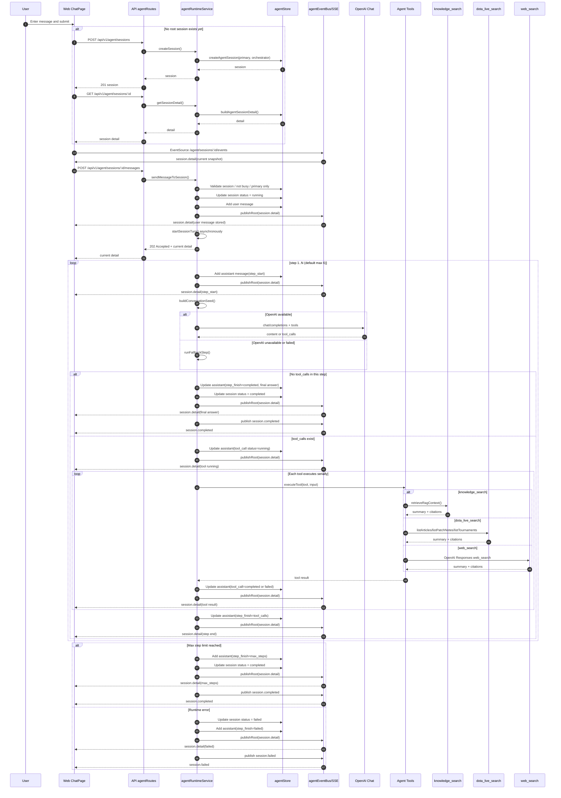
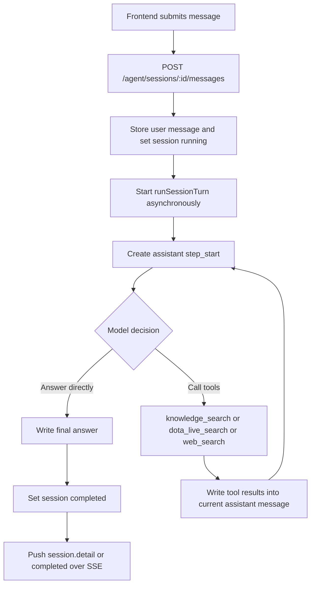

# Agent Runtime Sequence

## Scope

This document describes the current agent runtime behavior in the repository as of March 10, 2026.

It reflects the implementation that exists today:

- A single root session
- A primary `orchestrator`
- Tool execution inside the same session
- SSE session-detail updates to the frontend

It does not describe a future multi-subagent architecture.

## Current Runtime Summary

The current agent flow is not a true multi-agent workflow.

The runtime behaves like this:

1. The frontend creates or reuses one root session.
2. The user sends a message to that root session.
3. The backend stores the user message and marks the session as `running`.
4. The backend asynchronously starts an orchestrator loop.
5. The orchestrator either answers directly or issues tool calls.
6. Tool results are written back into the same assistant message as structured `tool_call` parts.
7. The backend publishes full session snapshots through SSE.
8. The frontend replaces local session detail state with each new snapshot.

## End-to-End Sequence

## Simplified Flow

## Current Behavior Notes

- The active runtime is single-session and single-orchestrator.
- `task_call`, `researcher`, `coach`, and child sessions exist in contracts and UI rendering paths, but they are not part of the live execution path today.
- Tool execution is serial, not parallel.
- The frontend receives whole-session snapshots, not token streaming.
- Session and message state are stored in in-memory maps, so agent state is not durable across server restarts.

## Main Code Locations

- API mount: `apps/api/src/app.ts`
- Agent routes: `apps/api/src/routes/agentRoutes.ts`
- Runtime loop: `apps/api/src/services/agent/agentRuntimeService.ts`
- Tool implementations: `apps/api/src/services/agent/agentTools.ts`
- OpenAI web search wrapper: `apps/api/src/services/agent/openAiWebSearchService.ts`
- Event bus: `apps/api/src/services/agent/agentEventBus.ts`
- In-memory session store: `apps/api/src/repo/agentStore.ts`
- Frontend API client: `apps/web/src/lib/api.ts`
- Frontend chat page: `apps/web/src/pages/ChatPage.tsx`
- Shared contracts: `packages/contracts/src/index.ts`
